<!--
  Aesthetic: Night Studio Console
  Palette: copper #E8A87C · phosphor #9AE6B4 · ice #7DD3FC · slate panel
  Motion: banner waveform · typing · contribution snake
-->

<div align="center">

  

  <br/><br/>

  [](https://git.io/typing-svg)

</div>


## `// identity`

**Zhirong Cai** — game systems, audio tooling, and agent extensibility.

游戏系统 · 音频工具 · Agent 扩展能力。少做模板，多做能进真实工作流的东西。

| channel | domain | notes |
|:--|:--|:--|
| `GAME` | Unity · Unreal Engine 5 | gameplay systems · engine architecture |
| `AUDIO` | signal · VST3 · film post | features · rules · measurable quality |
| `AGENT` | skills · plugins · tooling | tool loops · developer UX · MCP-style |


## `// work`

### [`SyncTrack-Prep`](https://github.com/caizhirong486-lab/SyncTrack-Prep)

```text
VST3 insert  ·  C++17 / JUCE 8  ·  macOS Universal 2 + Win x64  ·  AGPL-3.0
chain     channel repair → leveler → HPF → denoise → peak comp → −1 dBTP limit
latency   fixed 575 samples  ·  verified in Cubase / Nuendo
extras    offline CLI renderer  ·  3 analysis scripts (A/B · gate · stereo noise)
```

同期声修复、整平与真峰限制 —— 目标是对白可听度，不是投递响度。四个控件，固定延迟，宿主补偿准确。  
*Repairs, levels and true-peak-limits production audio for video post.*

### [`unity-agent-bootstrap`](https://github.com/caizhirong486-lab/unity-agent-bootstrap)

```text
Agent Skill  ·  Unity 2022.3 LTS  ·  MCP + Unity-Skills + Wwise 2024.1  ·  MIT
part A    automation — packages · editor auto-start · stdio client · checklist
part B    Wwise audio — version pairing · integration · SoundBank · code hookup
notes     11 documented gotchas with grep-able symptoms and fixes
```

把 Unity 工程接进 AI 辅助开发：MCP 桥、UnitySkills REST 通道、Wwise 接线。两条轨道各自独立，可单独使用。  
*Gets a Unity project ready for AI-assisted work. Two independent tracks.*


## `// stack`

```text
languages   C#  ·  C++  ·  Python  ·  TypeScript  ·  Rust
engines     Unity  ·  Unreal Engine 5  ·  Wwise
surfaces    JUCE / VST3  ·  Agent Skills  ·  Plugins  ·  MCP
```

<p align="center">
  
  
  
  
  
  <br/>
  
  
  
  
</p>


## `// focus`

```text
GAME     systems  ·  gameplay  ·  engine work
AUDIO    tooling  ·  signal-aware backends
AGENT    skills  ·  plugins  ·  developer UX
```

- **Interactive games** — 玩法逻辑、引擎架构与原生拓展  
  *Gameplay logic, engine architecture, native extensions*
- **Audible quality** — 特征、规则、分级，而不只是 demo  
  *Features, rules, grades — not just demos*
- **Extensible agents** — Skill / Plugin 优先，能接进真实工作流  
  *Skills & plugins that fit real workflows*


## `// activity`

<div align="center">

  <picture>
    <source media="(prefers-color-scheme: dark)" srcset="https://github-readme-stats.vercel.app/api?username=caizhirong486-lab&show_icons=true&theme=transparent&hide_border=true&bg_color=00000000&title_color=9AE6B4&icon_color=E8A87C&text_color=94A3B8&ring_color=9AE6B4" />
    <source media="(prefers-color-scheme: light)" srcset="https://github-readme-stats.vercel.app/api?username=caizhirong486-lab&show_icons=true&theme=transparent&hide_border=true&bg_color=00000000&title_color=0F766E&icon_color=C27A4A&text_color=475569&ring_color=0D9488" />
    
  </picture>
  <picture>
    <source media="(prefers-color-scheme: dark)" srcset="https://github-readme-stats.vercel.app/api/top-langs/?username=caizhirong486-lab&layout=compact&theme=transparent&hide_border=true&bg_color=00000000&title_color=9AE6B4&text_color=94A3B8" />
    <source media="(prefers-color-scheme: light)" srcset="https://github-readme-stats.vercel.app/api/top-langs/?username=caizhirong486-lab&layout=compact&theme=transparent&hide_border=true&bg_color=00000000&title_color=0F766E&text_color=475569" />
    
  </picture>

  <br/>

  <picture>
    <source media="(prefers-color-scheme: dark)" srcset="https://raw.githubusercontent.com/caizhirong486-lab/caizhirong486-lab/output/github-contribution-grid-snake-dark.svg" />
    <source media="(prefers-color-scheme: light)" srcset="https://raw.githubusercontent.com/caizhirong486-lab/caizhirong486-lab/output/github-contribution-grid-snake.svg" />
    
  </picture>

</div>


<div align="center">

```text
// games & audio in · agents out · skills everywhere
```

<sub>issues · [SyncTrack-Prep](https://github.com/caizhirong486-lab/SyncTrack-Prep/issues) · [unity-agent-bootstrap](https://github.com/caizhirong486-lab/unity-agent-bootstrap/issues)</sub>

<sub>thanks for stopping by</sub>

</div>
